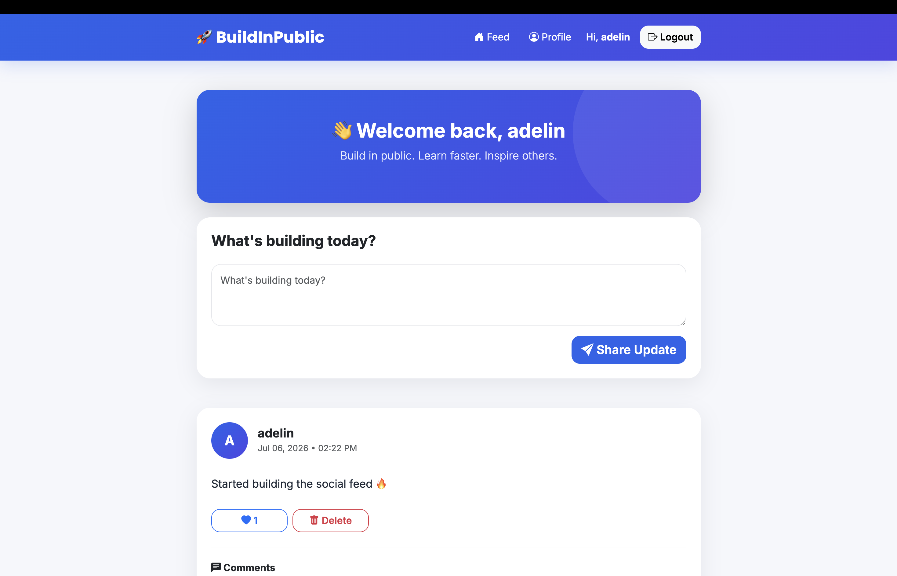
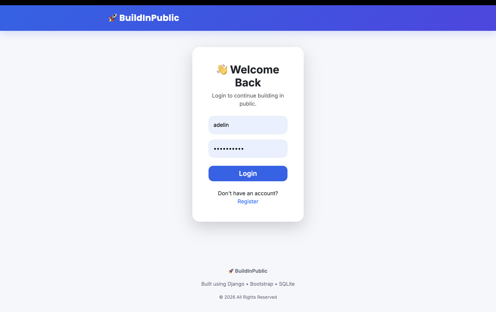
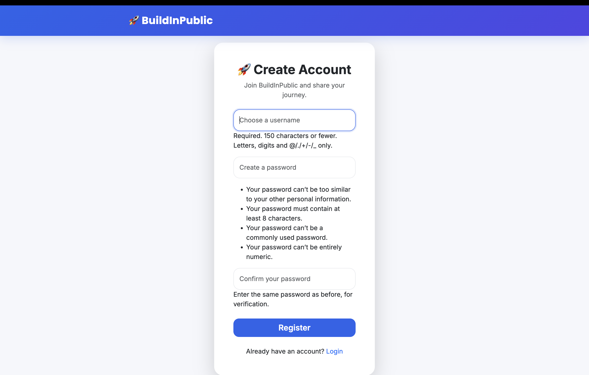

# 🌱 Build in Public

A full-stack social feed web application built using **Python, Django, Bootstrap, and SQLite**.

**Build in Public** is a platform where developers can document their learning journey by sharing progress updates, interacting with the community through likes and comments, and building consistency while learning. The application features secure authentication, a social feed, and a clean, responsive user interface.


---

## 🚀 Live Demo

🌐 **Live Website:**  
https://buildinpublic-jfn0.onrender.com

📂 **GitHub Repository:**  
https://github.com/adepat06/buildinpublic

---

## 📸 Screenshots

| Home Feed | Login |
|------------|-------|
|  |  |

| Register | Create Post |
|------------|-------------|
|  |  |

---

## ✨ Features

### 👤 User Authentication
- User Registration
- User Login
- User Logout
- Secure Password Authentication

### 📝 Social Feed
- Create Progress Updates
- View Posts in a Chronological Feed
- Delete Your Own Posts
- Share Your Learning Journey

### ❤️ Community Interaction
- Like & Unlike Posts
- Comment on Posts
- Engage with Other Users

### 👤 User Profiles
- Personal Profile Page
- User Bio
- Learning Goals

### 🎨 User Interface
- Responsive Design
- Bootstrap 5 Styling
- Mobile-Friendly Layout
- Modern & Clean Interface

---

## 🚀 Highlights

- Full-stack Django application
- Secure authentication system
- CRUD operations for posts
- Like & comment functionality
- Responsive Bootstrap UI
- Cloud deployment using Render
- Static file handling with WhiteNoise

---

## 🛠 Tech Stack

| Category | Technologies |
|----------|--------------|
| **Backend** | Python 3.11, Django 4.2 |
| **Frontend** | HTML5, CSS3, Bootstrap 5 |
| **Database** | SQLite |
| **Deployment** | Render, Gunicorn, WhiteNoise |
| **Version Control** | Git, GitHub |

---

## 📂 Project Structure

```text
buildinpublic/
│
├── accounts/
├── social/
├── templates/
│   ├── accounts/
│   ├── social/
│   └── base.html
├── static/
│   └── css/
├── screenshots/
├── config/
├── manage.py
├── build.sh
├── requirements.txt
└── runtime.txt
```

---

## ⚙️ Installation

### 1. Clone the Repository

```bash
git clone https://github.com/adepat06/buildinpublic.git
```

### 2. Navigate to the Project

```bash
cd buildinpublic
```

### 3. Create a Virtual Environment

```bash
python -m venv venv
```

### 4. Activate the Virtual Environment

**Mac/Linux**

```bash
source venv/bin/activate
```

**Windows**

```bash
venv\Scripts\activate
```

### 5. Install Dependencies

```bash
pip install -r requirements.txt
```

### 6. Apply Database Migrations

```bash
python manage.py migrate
```

### 7. Create a Superuser (Optional)

```bash
python manage.py createsuperuser
```

### 8. Run the Development Server

```bash
python manage.py runserver
```

### 9. Open in Your Browser

```
http://127.0.0.1:8000/
```

---

## 🧠 What I Learned

- Django Project Structure
- User Authentication
- Django ORM
- CRUD Operations
- Database Relationships
- Session Management
- URL Routing
- Template Rendering
- Bootstrap Integration
- WhiteNoise Configuration
- Deployment Using Render
- Git & GitHub Workflow
- Debugging Production Issues
- Responsive UI Development

---

## 🎯 Key Concepts Implemented

- Django ORM
- User Authentication
- Session Management
- CRUD Operations
- Foreign Keys
- Dynamic Templates
- Form Handling
- Bootstrap Components
- Database Migrations
- Production Deployment

---

## 🔮 Future Improvements

- Edit Posts
- Delete Comments
- Follow / Unfollow Users
- User Notifications
- Image Upload Support
- Search Users & Posts
- Hashtags
- Direct Messaging
- Dark Mode
- Infinite Scrolling
- Email Verification

---

## 🌟 Project Status

**Version 1.0 — ✅ Completed & Deployed**

### Implemented Features

- ✔ User Registration
- ✔ User Login
- ✔ User Logout
- ✔ Create Posts
- ✔ Delete Own Posts
- ✔ Like & Unlike Posts
- ✔ Comment on Posts
- ✔ User Profiles
- ✔ Responsive UI
- ✔ Cloud Deployment

---

## 👩‍💻 Author

**Adelin Patricia A**

- GitHub: https://github.com/adepat06
- LinkedIn: https://www.linkedin.com/in/adelin-patricia-a/

---

## ⭐ Support

If you found this project useful, consider giving it a **⭐ Star** on GitHub.

It helps others discover the project and supports future development.

---

## 📜 License

This project was created for educational and portfolio purposes.